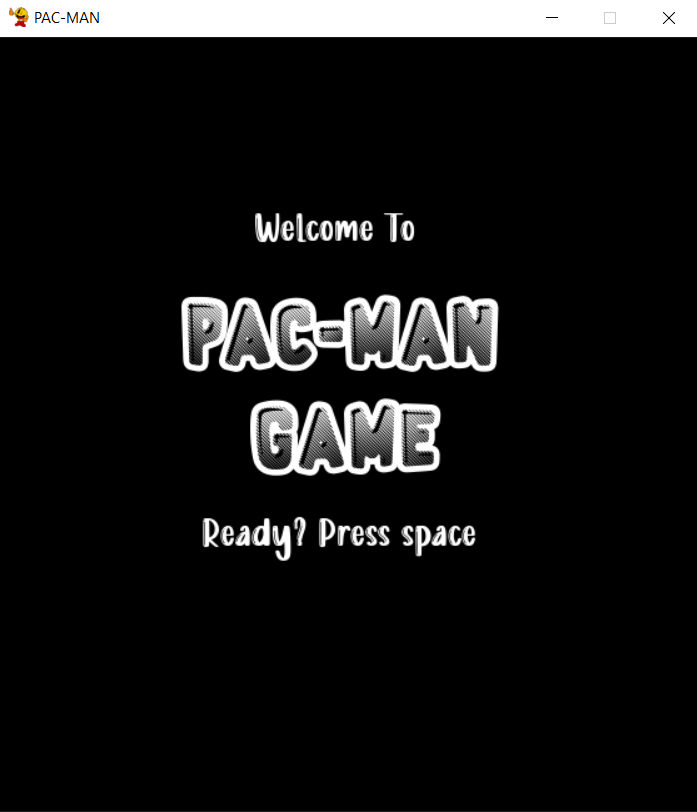

# PAC-MAN Game

## Introduction

Welcome to the PAC-MAN Game! This is a Python-based recreation of the classic arcade game PAC-MAN, implemented using the Pygame library. The project includes various game levels, enemy AI, and more, offering a nostalgic gaming experience.
PAC-MAN should reach the red door very quickly to achieve a high score.

## Features

- **Multiple Levels:** The game includes multiple levels with increasing difficulty.
  - First level: ghosts move randomly on the map.
  - Second level: Ghosts reach Pacman (DFS).
  - Third level: ghosts reach Pacman with the shortest path (BFS).
  - Fourth level: Ghosts surround Pacman.
- **Enemy AI:** Different AI behaviors are implemented for enemies, which adapt to the current level.
- **Custom Graphics:** Custom sprites and images are used to give the game a unique look.
- **Sound Effects:** Includes classic PAC-MAN sound effects for an immersive experience.
- **Score Tracking:** Tracks and displays the player's score and level.


_Pacman start the game_


_Pacman game play_


_Pacman lost_

## Requirements

- Python 3.6+
- Pygame 2.0+
- Fonts and images (provided in the `fonts` and `images` directories)
- Sound files (provided in the `music` directory)

## Installation

1. **Clone the repository:**

   ```bash
   git clone https://github.com/yourusername/pacman-game.git
   cd pacman-game
   ```

2. **Install dependencies:**

   ```bash
   pip install pygame
   ```

3. **Setup:**
   Ensure the `images`, `fonts`, and `music` directories are in the project root directory.

## Usage

To run the game, simply execute the `main.py` file:

```bash
python main.py

```

The game will start with an introductory screen. Press the space bar to begin playing.

## Game Controls

- Arrow Keys: Move PAC-MAN in the desired direction.
- Space Bar: Start the game or move to the next level.
